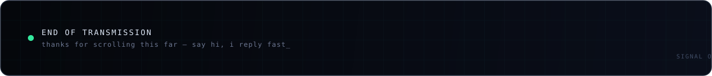

 

 

### `whoami`

I sit at the point where **hardware meets interface** — one day it's an Arduino learning to make facial expressions on a tiny OLED screen, the next it's a Shopify storefront that has to convert on mobile in under two seconds. Bahria University, CS, by way of a very cluttered breadboard drawer.

I like systems I can actually see working: a status LED, a live cursor, a robot that blinks back at you.

### `system.modules`

<table width="100%">
<tr>
<td width="33%" valign="top">

**`MODULE_01` — ACADEMIC**
▍CS undergrad

- Bahria University, Islamabad
- Core CS coursework — DBMS, Assembly, data structures & systems programming
- Recurring lab work compiled into full study guides, not just cram notes

</td>
<td width="33%" valign="top">

**`MODULE_02` — BUILDS**
▍hardware + product side-projects

- **EMO** — Arduino-driven robot with an animated OLED face
- **Sunflower** — mood tracking + journaling web app, synced across two users
- **Portfolio** — React / Vite / Framer Motion, scroll-stack project reveal

</td>
<td width="33%" valign="top">

**`MODULE_03` — COMMERCE**
▍client-facing web work

- Shopify development for direct-to-consumer brands
- Freelance front-end builds, deployed on Vercel / Netlify
- Design-to-storefront, end to end

</td>
</tr>
</table>

### `core.stack`

  

**Languages** &nbsp;

 

**Embedded** &nbsp;

 

**Web & Frontend** &nbsp;

 

**Commerce & Data** &nbsp;

### `live.telemetry`

<table width="100%">
<tr>
<td width="50%" valign="top">

</td>
<td width="50%" valign="top">

</td>
</tr>
<tr>
<td colspan="2" align="center">

</td>
</tr>
<tr>
<td colspan="2" align="center">

</td>
</tr>
</table>

### `contribution.feed`

generated nightly by <code>.github/workflows/snake.yml</code> — see setup notes below

### `connect`

  

 

<b>SETUP NOTES</b> — read before pushing (click to expand)

 

This whole thing is a special repo GitHub turns into your profile page: create a repository named **exactly** `GARFIELD5211/GARFIELD5211`, public, and drop these files in the root. Usernames are already wired up throughout — nothing to find/replace there.

1. **Keep the `assets/` folder** — `hero-banner.svg`, `divider.svg`, and `footer-bar.svg` are referenced by relative path, so they need to live in the repo, not just on your machine.
2. **Turn on the contribution snake** — commit `.github/workflows/snake.yml` (included), then in the repo go to **Settings → Actions → General → Workflow permissions** and enable *Read and write permissions*. It runs nightly and pushes the animated grid to an `output` branch, which is what the `contribution.feed` image points at.
3. **Real email/links** — update the `mailto:` address and the LinkedIn / portfolio badge URLs at the bottom (the LinkedIn one is still a placeholder path, not your actual profile).
4. Everything else (stats, streak, top languages, activity graph, typing ticker) is a live third-party badge — it updates on its own, no maintenance needed.

