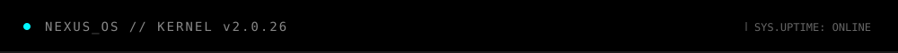
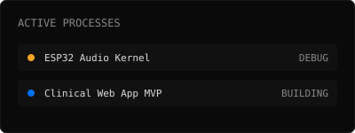

<!-- Top Navigation / Header HUD -->

<!-- Main Split Layout -->
<table width="100%" style="border-collapse: collapse; border: none;">
<tr style="border: none;">
<!-- Left Column: Terminal Interface -->
<td width="60%" valign="top" style="border: none; padding: 0 10px 0 0;">

</td>

<!-- Right Column: Live Metrics (From Actions) & Status -->
<td width="40%" valign="top" style="border: none; padding: 0 0 0 10px;">

 
<!-- The live metrics SVG generated by GitHub Actions -->

</td>
</tr>
</table>

